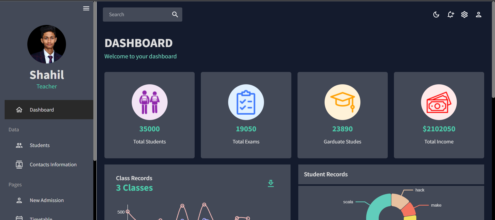
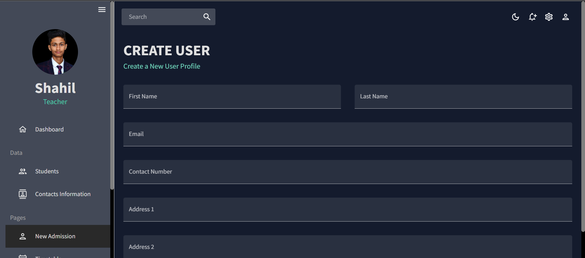
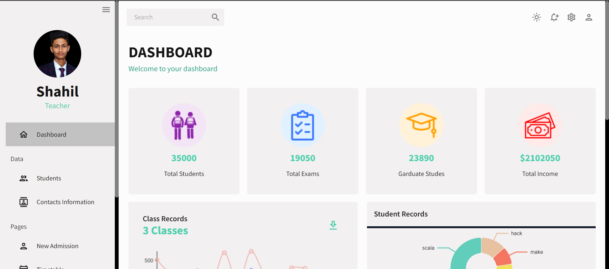

<!-- Improved compatibility of back to top link: See: https://github.com/Shahil9728/ReactDashboard/ -->

<!-- PROJECT LOGO -->
 

  

  <h3 align="center"><a href="https://tutotube-frontend.onrender.com" target="_blank">ReactDashboard</a></h3>
  

     
     
    <a href="https://github.com/Shahil9728/ReactDashboard/issues">Report Bug</a>
    ·
    <a href="https://github.com/Shahil9728/ReactDashboard/issues">Request Feature</a>
  

### ReactDashboard

### Project Link: [https://tutotube-frontend.onrender.com](https://tutotube-frontend.onrender.com)
Must visit it in dark mode for better view !🥰 

### Introduction

Our Teacher Dashboard, built with React.js, is a user-friendly web application that enables teachers to efficiently manage student details, classes, events, and credentials. With a holistic view of student profiles, teachers can access essential information such as contact details, academic performance, and attendance records. Class management is simplified through features like roster organization and student engagement monitoring. The dashboard's event scheduling capabilities facilitate the arrangement of exams, assignments, field trips, and parent-teacher meetings, with automated notifications keeping everyone informed. Quick access to student credentials eliminates manual searches. Notably, the dashboard's responsive design ensures seamless usage across devices. It adapts to various screen sizes, providing a consistent experience. Overall, our Teacher Dashboard streamlines administrative tasks, allowing teachers to focus on delivering quality education, while offering a user-friendly interface and convenient accessibility.

<!-- IMAGES -->
### WEBSITe SCREENSHOTS

 

### Built With

This section lists about the languages used in this project .

* 
* 
* 
* 
* 

 

 
 

(<a href="#readme-top">back to top</a>)

<!-- CONTACT -->
## Contact

Your Name - [@Shahil9728](https://twitter.com/Shahil9728) - shahilverma91383@gmail.com

Project Link: [https://tutotube-frontend.onrender.com](https://tutotube-frontend.onrender.com)

(<a href="#readme-top">back to top</a>)

